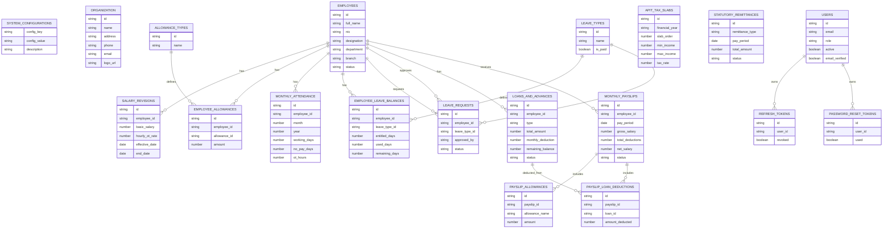

```mermaid
erDiagram
    SYSTEM_CONFIGURATIONS {
        string config_key
        string config_value
        string description
    }

    ORGANIZATION {
        string id
        string name
        string address
        string phone
        string email
        string logo_url
    }

    EMPLOYEES {
        string id
        string full_name
        string nic
        string designation
        string department
        string branch
        string status
    }

    SALARY_REVISIONS {
        string id
        string employee_id
        number basic_salary
        number hourly_ot_rate
        date effective_date
        date end_date
    }

    ALLOWANCE_TYPES {
        string id
        string name
    }

    EMPLOYEE_ALLOWANCES {
        string id
        string employee_id
        string allowance_id
        number amount
    }

    MONTHLY_ATTENDANCE {
        string id
        string employee_id
        number month
        number year
        number working_days
        number no_pay_days
        number ot_hours
    }

    LEAVE_TYPES {
        string id
        string name
        boolean is_paid
    }

    EMPLOYEE_LEAVE_BALANCES {
        string id
        string employee_id
        string leave_type_id
        number entitled_days
        number used_days
        number remaining_days
    }

    LEAVE_REQUESTS {
        string id
        string employee_id
        string leave_type_id
        string approved_by
        string status
    }

    APIT_TAX_SLABS {
        string id
        string financial_year
        number slab_order
        number min_income
        number max_income
        number tax_rate
    }

    LOANS_AND_ADVANCES {
        string id
        string employee_id
        string type
        number total_amount
        number monthly_deduction
        number remaining_balance
        string status
    }

    MONTHLY_PAYSLIPS {
        string id
        string employee_id
        date pay_period
        number gross_salary
        number total_deductions
        number net_salary
        string status
    }

    PAYSLIP_ALLOWANCES {
        string id
        string payslip_id
        string allowance_name
        number amount
    }

    PAYSLIP_LOAN_DEDUCTIONS {
        string id
        string payslip_id
        string loan_id
        number amount_deducted
    }

    STATUTORY_REMITTANCES {
        string id
        string remittance_type
        date pay_period
        number total_amount
        string status
    }

    USERS {
        string id
        string email
        string role
        boolean active
        boolean email_verified
    }

    REFRESH_TOKENS {
        string id
        string user_id
        boolean revoked
    }

    PASSWORD_RESET_TOKENS {
        string id
        string user_id
        boolean used
    }

    EMPLOYEES ||--o{ SALARY_REVISIONS : has
    EMPLOYEES ||--o{ EMPLOYEE_ALLOWANCES : has
    ALLOWANCE_TYPES ||--o{ EMPLOYEE_ALLOWANCES : defines
    EMPLOYEES ||--o{ MONTHLY_ATTENDANCE : has
    EMPLOYEES ||--o{ EMPLOYEE_LEAVE_BALANCES : has
    LEAVE_TYPES ||--o{ EMPLOYEE_LEAVE_BALANCES : defines
    EMPLOYEES ||--o{ LEAVE_REQUESTS : requests
    LEAVE_TYPES ||--o{ LEAVE_REQUESTS : type
    EMPLOYEES ||--o{ LEAVE_REQUESTS : approves
    EMPLOYEES ||--o{ LOANS_AND_ADVANCES : has
    EMPLOYEES ||--o{ MONTHLY_PAYSLIPS : receives
    MONTHLY_PAYSLIPS ||--o{ PAYSLIP_ALLOWANCES : includes
    MONTHLY_PAYSLIPS ||--o{ PAYSLIP_LOAN_DEDUCTIONS : includes
    LOANS_AND_ADVANCES ||--o{ PAYSLIP_LOAN_DEDUCTIONS : deducted_from
    USERS ||--o{ REFRESH_TOKENS : owns
    USERS ||--o{ PASSWORD_RESET_TOKENS : owns
```
