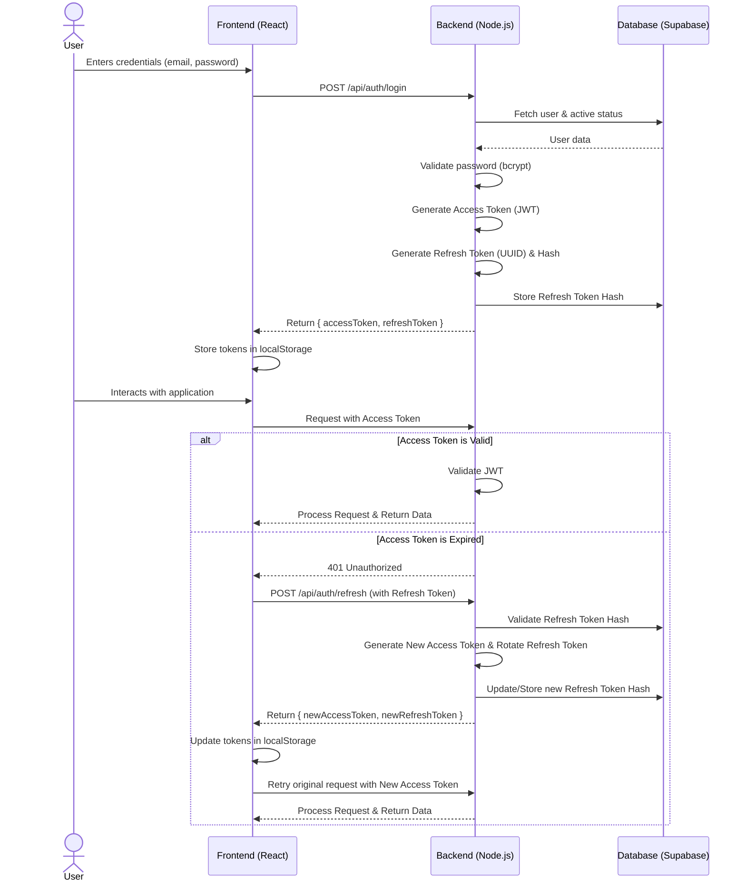

# Authentication Flow Documentation

The Green Solutions Tech HR Payroll System uses a robust and secure authentication flow based on JSON Web Tokens (JWT). The system utilizes a dual-token approach (Access Tokens and Refresh Tokens) to ensure security while maintaining a smooth user experience.

## Overview

The authentication system relies on the following key components:

1.  **Access Token:** A short-lived JWT used to authenticate API requests.
2.  **Refresh Token:** A long-lived token (stored securely in the backend and frontend) used to obtain new Access Tokens without requiring the user to log in again.
3.  **Frontend State Management:** Access and refresh tokens are stored in `localStorage` to persist sessions across browser reloads. Centralized Axios interceptors handle automatic attaching of access tokens and seamless background refreshing when a token expires.
4.  **OTP (One-Time Password) Verification:** Used for the "Forgot Password" and new user onboarding flows to securely verify email addresses.
5.  **Role-Based Access Control (RBAC):** Roles (e.g., Admin, Employee) are encoded within the Access Token and enforced by backend middleware and frontend routing.

## Authentication Flow Diagram

## Detailed Workflows

### 1. Login
*   **Action:** The user submits their email and password.
*   **Backend Verification:** The backend verifies the credentials against the database (`users` table) using `bcryptjs`.
*   **Token Generation:** If successful, a short-lived `accessToken` (signed JWT) and a long-lived `refreshToken` (UUID) are generated. The refresh token is hashed (SHA-256) before being stored in the `refresh_tokens` database table to prevent database compromise from revealing usable tokens.
*   **Frontend Storage:** The frontend receives both tokens and stores them in `localStorage`.

### 2. API Requests & Token Refresh
*   **Axios Interceptor:** The frontend uses a centralized Axios instance (`frontend/src/services/api.js`). A request interceptor automatically attaches the `accessToken` to the `Authorization` header (`Bearer <token>`).
*   **401 Handling:** If the backend returns a `401 Unauthorized` (indicating an expired access token), an Axios response interceptor catches the error.
*   **Queueing Mechanism:** To prevent multiple simultaneous refresh requests, the interceptor uses a lock (`isRefreshing`) and a `failedQueue`. Concurrent requests are queued until the refresh completes.
*   **Refresh Request:** A request is made to `/api/auth/refresh` using the stored `refreshToken`.
*   **Rotation:** The backend validates the refresh token hash against the database. If valid, it generates a *new* access token and a *new* refresh token (token rotation). The old refresh token is revoked.
*   **Retry:** The frontend updates its stored tokens and automatically retries the queued failed requests with the new access token.
*   **Graceful Expiry:** If the refresh request itself fails (e.g., refresh token is expired or revoked), the frontend clears local storage and dispatches an `auth:unauthorized` window event, redirecting the user to `/login?expired=true`.

### 3. Forgot Password / Password Reset Flow
*   **Forgot Password Request:** The user submits their email (`/api/auth/forgot-password`). The backend generates a 6-digit numeric OTP, hashes it, stores it in the database with an expiration time, and sends the raw OTP via email (using `nodemailer`/Mailtrap). The API always returns 200 to prevent email enumeration.
*   **OTP Verification:** The user enters the OTP (`/api/auth/verify-otp`). The backend compares the hashed OTP.
*   **Password Reset:** The user submits the OTP along with a new password (`/api/auth/reset-password`). The backend verifies the OTP again, updates the user's `password_hash`, and immediately revokes all existing refresh tokens for that user to terminate any active sessions on other devices.

### 4. New User Onboarding (Extensibility)
*   When a new employee is created by an Admin, a similar OTP or unique registration link flow can be initiated.
*   The system can generate a one-time setup token or OTP and email it to the new user.
*   The user accesses a "Set Password" screen, verifies the token/OTP, and establishes their initial password, after which they can log in via the standard flow.

## Extensibility

This authentication architecture is highly modular and easily extensible:
*   **SSO Integration:** OAuth2 or SAML providers (e.g., Google Workspace, Microsoft Entra ID) can be added by creating new endpoints that validate external provider tokens and issue the internal `accessToken`/`refreshToken` pair.
*   **MFA (Multi-Factor Authentication):** Time-based One-Time Passwords (TOTP) can be integrated by adding an intermediate "MFA Required" state during login. The backend would issue a temporary token, and only issue the full access/refresh tokens after the user successfully provides the TOTP code.
*   **Device Management:** Since each device gets a unique refresh token stored in the `refresh_tokens` table, it is simple to implement a "Manage Sessions" feature where users can view and revoke sessions on individual devices.
