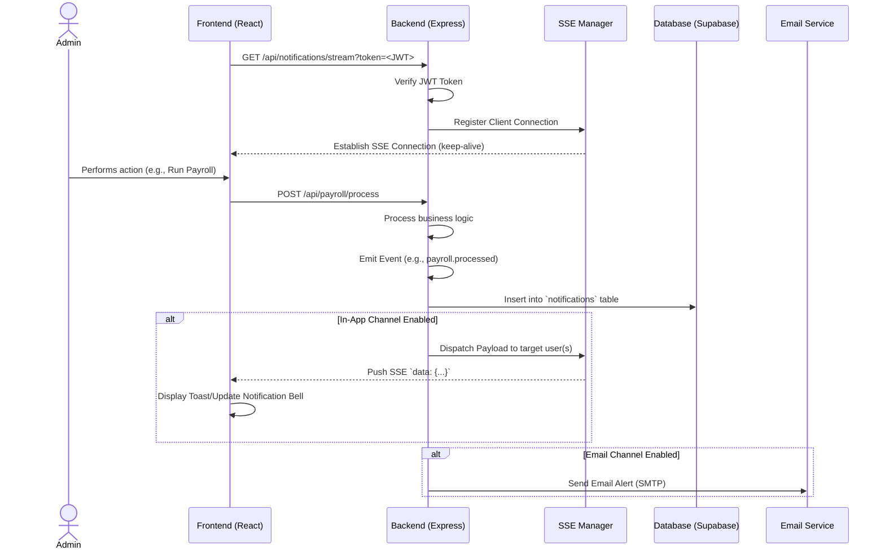

# Notification System Documentation

The Green Solutions Tech HR Payroll System features a real-time notification architecture designed to alert users immediately about important events (e.g., payroll processing, salary revisions, employee creation) without requiring manual page refreshes.

## Overview

The notification system utilizes **Server-Sent Events (SSE)** for unidirectional real-time updates from the backend to the frontend. It is combined with database persistence and an optional email fallback channel.

1. **In-App Real-Time (SSE):** Pushes events instantly to connected clients.
2. **Database Persistence:** All notifications are stored in the `notifications` table (Supabase) so users can view missed alerts and historical logs.
3. **Email Channel:** Critical alerts can optionally be routed to an email provider (configured via standard SMTP/Mailtrap).

## Notification Flow Diagram



## Detailed Workflows

### 1. Connection Establishment (Frontend to Backend)
*   **Protocol:** Standard HTTP `EventSource` interface in the React application.
*   **Authentication:** Because the native `EventSource` API does not support custom HTTP headers (like `Authorization: Bearer`), the frontend must pass the JWT access token as a URL query parameter: `?token=<JWT>`.
*   **Backend Verification:** The Express route (`/api/notifications/stream`) extracts the token from the query string, verifies it using `jsonwebtoken`, and extracts the `userId`.
*   **Registration:** The `userId` and the open HTTP response (`res`) object are stored in an in-memory `Map` within the `sseManager.js`.
*   **Heartbeat:** The backend sends a `:heartbeat` comment every 30 seconds to prevent reverse proxies or load balancers from closing the idle connection.

### 2. Event Dispatching
*   When a significant system action occurs (e.g., an employee's salary is updated in `salaryController.js`), the controller calls `notificationService.createNotification()`.
*   The service first persists the notification to the Supabase database.
*   It then checks the requested channels:
    *   **In-App (`sseManager`):** The service looks up the `userId` in the `Map`. If found, it writes the serialized JSON payload to the corresponding response stream. If no specific recipient is targeted (e.g., a global broadcast), it iterates over all connected clients.
    *   **Email (`emailTransport`):** The service looks up the recipient's email and sends a formatted HTML email using the configured SMTP server.

### 3. Frontend Integration (React)
*   **Connection Management:** The frontend typically establishes the `EventSource` connection in a top-level component (e.g., inside an `AuthContext` or a main `Layout` component) within a `useEffect` hook.
*   **State Tracking:** A `useRef` tracks the active `EventSource` instance to prevent duplicate connections during re-renders.
*   **Dynamic URLs:** The connection URL is constructed dynamically to inject the current token. If the token changes (e.g., during a refresh cycle), the previous connection is closed (`.close()`), and a new one is instantiated.
*   **Event Handling:** The frontend listens for the standard `message` event. When a new payload arrives, it dispatches a UI toast notification (e.g., using Ant Design's `notification` API) and updates the unread badge count in the top navigation bar.

## Extensibility

*   **Pub/Sub Scaling:** The current `sseManager.js` uses an in-memory `Map`, which is sufficient for a single Node.js instance. To scale horizontally across multiple backend instances, this can be easily replaced with a Redis Pub/Sub architecture. When an instance creates a notification, it publishes it to Redis; all instances subscribe to Redis and push to their specific locally connected SSE clients.
*   **Extensible Event Templates in Code:** Adding entirely new notifications is highly extensible and declarative because the system uses a central template registry (`backend/src/notifications/templates/index.js`):
    1.  **Create a new template file** (e.g., `payroll.processed.js`):
        ```javascript
        module.exports = ({ period, totalAmount }) => ({
          title: 'Payroll Processed',
          body: `Payroll for ${period} has been finalized.`,
          email: {
            subject: 'Payroll Finalized',
            html: `<p>Total amount processed: <strong>${totalAmount}</strong>.</p>`
          }
        });
        ```
    2.  **Register it in `index.js`:**
        ```javascript
        const payrollProcessed = require('./payroll.processed');
        const TEMPLATES = { ..., 'payroll.processed': payrollProcessed };
        ```
    3.  **Trigger the Notification Easily:** Controllers can instantly send this specific notification by just passing the correct template `type` string:
        ```javascript
        await notificationService.createNotification({
          type: 'payroll.processed', // Easily select the notification kind
          payload: { period: 'March 2024', totalAmount: '15000' },
          channels: ['in_app', 'email']
        });
        ```
*   **Adding New Channels (e.g., SMS, Slack, Webhooks):** The template-based approach makes adding new notification channels highly extensible:
    1.  **Define a Template:** Add a new channel object (e.g., `sms: { body: '...' }` or `slack: { text: '...' }`) to the relevant event templates in `templates/index.js`.
    2.  **Add Channel Logic:** In `notificationService.createNotification()`, add a new conditional block (e.g., `if (channels.includes('sms') && template.sms)`) to handle dispatching the payload to the third-party API (like Twilio or Slack Webhooks).
    3.  **Specify Channels:** When triggering the notification from the controller, simply include the new channel in the `channels` array parameter (e.g., `channels: ['in_app', 'email', 'sms']`).
*   **Granular Preferences:** The schema can be extended to include a `user_notification_preferences` table, allowing users to toggle specific channels (e.g., turn off emails for payroll but keep them for account changes), which the backend service would respect before dispatching.